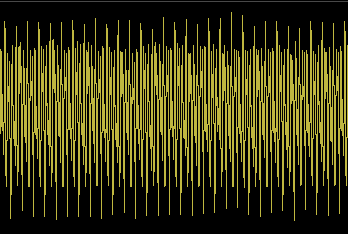
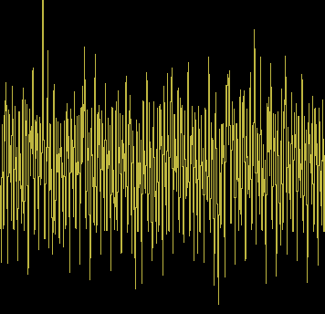

# Tiles Game Demo Intan Interface
This is the Intan Interface for the white tiles demo for ECE202 Group 7. The purpose of this interface is to connect to the Intan software, read the EMG data frome **TWO** channels and convert to game controls, i.e. left arm = move left, right arm = move right.  

### Task List:
* [x] Read from Intan
* [ ] Calibration
    * Determine resting potential range
    * Determine threshold for "flexing" potential minimum
* [ ] Read from 2 channels
* [ ] Link to game movements

### Calibration:
Calibration detects the standard deviation of potential of both resting and flexing. A lower threshold of which the standard deviation must exceed to be considered "flexing" is computed as a percentage between the two state's standard deviation. Two version of standard deviation were calculated, tested, and compared under three trials of the same sample EMG recording:
1. `np.abs(data)`, where all potentials considered were absolute valued to find the std. dev. Trials 1 and 2 computes the threshold at 50%. Trials 3 and 4 computes the threshold at 25% and 10% respectively. This decision was made on the uniformity (specifically the observable pattern) such that we can expect resting standard deviation to always be relatively close to the calibrated resting standard deviation with some error.
| Trial | Resting STD | Flexing STD | Threshold [\%] | Success Rate |
| ----- | ----------- | ----------- | -------------- | ------------ |
|   1   |  242.62885  |  267.21950  | 254.92418 [50\%] |     2/4      |
|   2   |  242.58384  |  266.63958  | 254.61171 [50\%] |     3/4      |
|   3   |  242.75175  |  268.25693  | 249.12804 [25\%] |     3/4      |
|   4   |  243.20143  |  266.22612  | 245.50391 [10\%] |     3/4      |

2. Just `data` by itself were considered for the std. dev. Other parameters for each trial are the same as above.
| Trial | Resting STD | Flexing STD | Threshold [\%] | Success Rate |
| ----- | ----------- | ----------- | -------------- | ------------ |
|   1   |  453.70970  |  476.00338  | 464.85654 [50\%] |     1/4      |
|   1   |  453.53124  |  476.23867  | 464.88496 [50\%] |     1/4      |
|   3   |  454.50418  |  474.86977  | 459.59558 [25\%] |     1/4      |
|   4   |  453.80710  |  475.34262  | 455.96064 [10\%] |     1/4      |

Why standard deviation? If we look at the following EMG recording plot for resting state:
!
We observe regular and smaller potential variance such that a pattern can be recognized. However, if we look at the EMG recording plot for flexing state:

We can observe a more chaotic variance in the potentials such that we cannot observe a regular pattern. It becomes clear that the standard deviation is higher for the flexing state.

### Notes:
Recorded data is in microV for potential over seconds

Please do not use without permission.  
\- Stephen Dong